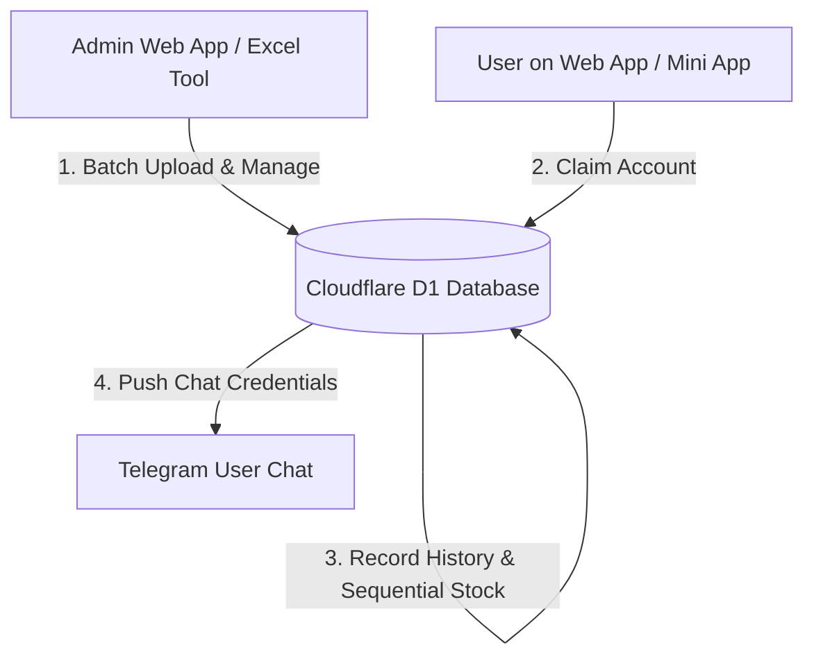

# 🚀 TG-BOT Web App & Cloudflare D1 Management System V3.0.3

ប្រព័ន្ធគ្រប់គ្រង និងចែកចាយគណនី (Telegram Mini App & Web Portal System) ដែលដំណើរការលើ **Cloudflare Pages / Workers** និង **Cloudflare D1 Database** ជាមួយមុខងារទំនើបៗជាច្រើន។

---

## 🌟 មុខងារចម្បងៗ (Key Features)

- 📱 **Telegram Mini App (2-Column Telegram Inline Keyboard Layout):**
  - ប៊ូតុងរៀបចំជា ២ ជួរស្មើគ្នា (2-Column Grid) ដូច Telegram Reply Keyboard។
  - ផ្ទៃប្រអប់ពណ៌ខៀវខ្ចី Gradient (`#0284c7`) រំលេចដោយអក្សរឈ្មោះ និងចំនួនស្តុកពណ៌សសុទ្ធ (`#FFFFFF`)។
  - `🎮 CK9999` ត្រូវបានកំណត់ជា Default Category ពេលបើកមកមុនគេ។
- 📊 **ប្រព័ន្ធគ្រប់គ្រងស្តុកតាម Real-Time (Live Stock Counter):**
  - ចំនួនស្តុកសរុប (ឧ. `185`, `217`) បង្ហាញនៅជ្រុងស្តាំលើនៃ Category នីមួយៗ។
  - គ្មានរូប Emoji ក្នុងប៊ូតុង Sub-Menu នៅលើ Web App ធ្វើឱ្យទំព័រសាតស្អាត។
- 📋 **1-Click Copy & Direct Telegram Message Delivery:**
  - ចុចប៊ូតុង `📋 ចម្លង (Copy)` ដើម្បីចម្លង `Username` & `Password` ចូល Clipboard។
  - បោះសារចូល Telegram Chat របស់ User ដោយស្វ័យប្រវត្តិ។
  - បិទផ្ទាំង Mini App ត្រឡប់ទៅ Telegram Chat ភ្លាមៗ។
  - **Single History Guarantee:** កត់ត្រា History តែ **១ លើកគត់** (មិនស្ទួន 2 History ឡើយ)។
- 📜 **ប្រវត្តិទាញយក និងការលុប (History & Single Log Deletion):**
  - គណនាចំនួនស្តុកនៅសល់តាមប្រវត្តិលំដាប់លំដោយពិតប្រាកដ (`54, 53, 52`)។
  - មុខងារលុបប្រវត្តិម្តងមួយៗ (Delete History One by One) ជាមួយពាក្យសម្ងាត់ Admin (`13579`)។
- 📥 **Excel Batch Upload & Export Tool:**
  - ផ្ទាំងបញ្ចូលអាខោនច្រើនក្នុងពេលតែមួយតាម Excel File (`.xlsx`)។
  - Export របាយការណ៍ History និង Accounts ទៅជា `.xlsx` ដោយចុចតែ ១ ចុច។

---

## 🏗️ រចនាសម្ព័ន្ធផ្លូវទិន្នន័យ (Architecture)



---

## 🔒 សុវត្ថិភាព (Security & Environment Variables)

កូដក្នុង Repository នេះត្រូវបានសំអាត (Sanitized) គ្មានបញ្ចូន Token ឬ Password ឡើយ ៖

| Variable | Description |
| :--- | :--- |
| `BOT_TOKEN` | Telegram Bot Token ទទួលបានពី [@BotFather](https://t.me/BotFather) |
| `ADMIN_PASSWORD` | ពាក្យសម្ងាត់ Admin (Default: `13579`) |

### របៀបកំណត់ `BOT_TOKEN` លើ Cloudflare ៖
1. ចូលទៅកាន់ **Cloudflare Dashboard** ➔ **Workers & Pages** ➔ **tgbot-web-app**
2. ចូល **Settings** ➔ **Environment Variables**
3. បន្ថែម `BOT_TOKEN` = `[Your Telegram Bot Token]`
4. ចុច **Save and Deploy**។

---

## 🚀 របៀបយកទៅ Deploy លើ Cloudflare Pages / Workers

```bash
# 1. Install Wrangler CLI
npm install -g wrangler

# 2. Deploy Web App to Cloudflare Pages
npx wrangler pages deploy public --project-name=tgbot-web-app

# 3. Deploy Worker Engine to Cloudflare Workers
npx wrangler deploy
```

---

## 📦 របៀបទម្លាក់ Code ទៅកាន់ GitHub (GitHub Setup)

```bash
# 1. Initialise Git Repository
git init

# 2. Add files (Security file .gitignore includes secrets automatically)
git add .

# 3. Commit changes
git commit -m "Initial commit - Sanitized TG-BOT V3.0.3 Web App"

# 4. Link & Push to GitHub Repository
git branch -M main
git remote add origin https://github.com/YOUR_USERNAME/YOUR_REPOSITORY.git
git push -u origin main
```
